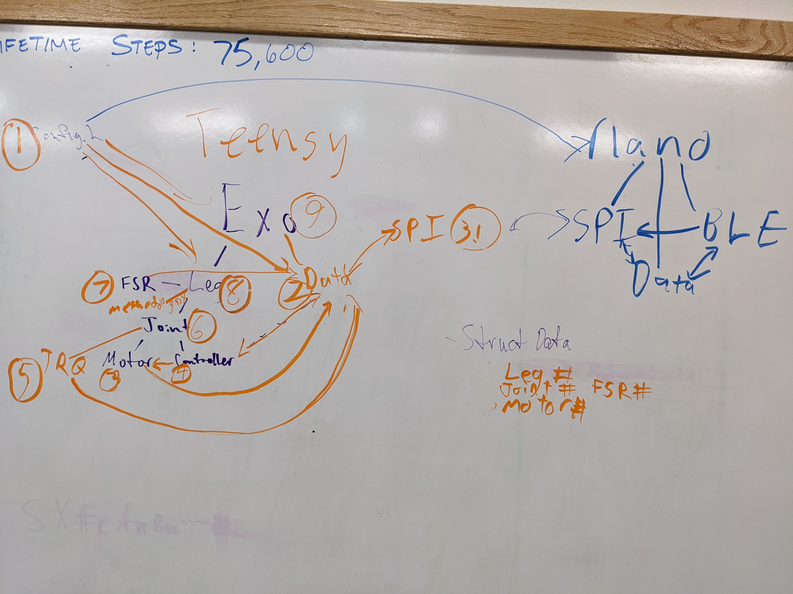

# Nano Teensy Board

This code is for the CAN based motors on boards where the nano handles low frequency sampling (eg. battery voltage), and Bluetooth communication; and the teensy handles high frequeny sampling and controls.  The two boards communicate through SPI.

- Config.h (Paul [in progress])

## NanoCode (Chance [in progress])
### Classes
Chance I am going to let you handle most of this but I am going to provide some structure, feel free to change.  You can find the pins in the TMotor_Exo_PCB, WithTeensy branch.
- Bluetooth handler
- spi handler (Teensy Communication)
- i2c handler (Battery Voltage)
- Data

## TeensyCode (Mixed [in progress])
### Classes
We can tag which one of us is working on what when we get there.
- Sync LED (Paul [Complete])
- Status LED (Paul [Complete])
- SPI Handler (Chance [not started]) I added this to Chance since it seems tied to the Nano SPI, so it will be easier for an individual to debug.
- Data 
- Exo
- Joint
- Leg 
- FSR
- Controller
- Motor (Chance [not started]) I am giving you this one as you have more experience with CAN
- TorqueSensor

MORE DETAILS TO COME
Probably need to create a consistent/shared SPI interface
