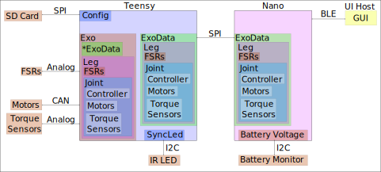

# Nano Teensy Board

This code is for the CAN based motors on boards where the nano handles low frequency sampling (eg. battery voltage), and Bluetooth communication; and the teensy handles high frequeny sampling and controls.  The two boards communicate through SPI.

## Common Code (Mixed [in progress])
- [x] Configuration reading (Paul)
- [x] Data structure (Paul)
- [x] Modify Run methods to check Exo_Data and perform Exo tasks (Paul)
- [ ] Add a check to the controller to ensure that the user updates the controller parameters when changing 
controllers.


## Nano Specific Code (Chance [in progress])
### Classes
Chance I am going to let you handle most of this but I am going to provide some structure, feel free to change.  You can find the pins in the TMotor_Exo_PCB, WithTeensy branch.
- [X] Bluetooth handler
- [ ] spi handler (Teensy Communication)
- [X] i2c handler (Battery Voltage)
- [ ] Use the modified torque command to set the controller from the sd card

## Teensy Specific Code (Mixed [in progress])
### Classes
We can tag which one of us is working on what when we get there.
- [X] Sync LED (Paul)
- [X] Status LED (Paul)
- [ ] SPI Handler (Chance [not started]) I added this to Chance since it seems tied to the Nano SPI, so it will be easier for an individual to debug.
- [X] Exo (Paul)
- [X] Leg (Paul)
- [X] Joint (Paul)
- [X] FSR (Paul)
- [X] Controller (Paul)
- [X] Motor (Chance [working on CAN]) I am giving you this one as you have more experience with CAN
- [X] TorqueSensor (Paul)



## Libraries
The libraries should be moved to C:\Users\\\[USER\]\Documents\Arduino\libraries\ or system equivalent
### SPISlave_T4
- Git: https://github.com/tonton81/SPISlave_T4
- Commit: 28d8c1fd6082335d597483d45121d9db4c9cfc5c
- Modifications: 
    - SPISlave_T4.tpp 
        - line 18 changed to 

            ```static void lpspi4_slave_isr() {``` 

            to avoid multiple definition error.
### TSPISlave
- Git: https://github.com/tonton81/TSPISlave
- Commit: 492100f7f41a6d9d3888ed68b1e326a58f11f47a
- Modifications: None

### IniFile
- Git: https://github.com/stevemarple/IniFile
- Commit: 880edeac620f262b804fce500bfbbb1227c5cba9
- Modifications: None

### Adafruit_BluefruitLE_nRF51
- Git: https://github.com/adafruit/Adafruit_BluefruitLE_nRF51
- Commit: 16412c28c5d25eb2577c0d5bbac85f3c7dc7baae
- Modifications: 
    - Adafruit_BluefruitLE_SPI.cpp 
        - line 45 changed to:  
        
            ```SPISettings bluefruitSPI(1000000, MSBFIRST, SPI_MODE0);```  
            
            Due to teensy speed issue
## Optimizations
- SPI direct memory access. Should change SPI time from 20 $\mu$s per byte to the time to write the memory.
- BLEparser change from char representation to num bytes, expect 3 to 6x speed up.
- CAN direct memory access, should cut about 250 $\mu$s per motor.

## MORE DETAILS TO COME
Probably need to create a consistent/shared SPI interface
